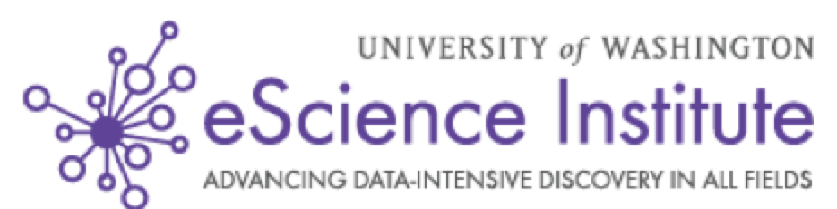

class: center, middle

# Analyzing Big Neuroscience Imaging Data
## Ariel Rokem
### The University of Washington eScience Institute

<small>Follow along at: <a href="https://arokem.github.io/msdse-summit-lightning-mri/">https://arokem.github.io/msdse-summit-lightning-mri/</small>

---

## In collaboration with:
- Magda Balazinska (eScience, UW CSE)
- Alvin Cheung (eScience, UW CSE)
- Parmita Mehta (UW CSE)
- Dongfang Zhao (eScience, UW CSE)
- Sven Dorkenwald (UW CSE, Max-Planck Institute for Medical Research)
- Tomer Kaftan (UW CSE)
- Jason Yeatman (UW ILABS)
- Libby Huber (UW ILABS)
- Rafael Neto Henriques (Cambridge University)

---

layout: true

<image src="images/escience-network.png" width=500px style="opacity:0.4;filter:alpha(opacity=40);"> 

---

### Precision medicine

<image src="images/obama_and_dna.jpg"  height="30%">

Making medicine
#### Personalized, Predictive, Preventative, Participatory

<small><a href="http://www.ncbi.nlm.nih.gov/pmc/articles/PMC3978637/">Hood and Auffray (2013)</a></small>

---

### MRI

<video id="mri-zstack" preload="auto" width="85%" height="auto" data-setup="{}" autoplay loop ><source src="./videos/mri-zstack.mov"/></video>

---
### Human white matter

<video preload="auto" width="60%" height="auto" data-setup="{}" autoplay loop ><source src="./videos/cc_tube_movie.mov"/> </video>

#### Dipy

---

### The human connectome project : a brain observatory

---

### Lots of data

<image src="images/vanhorn-toga-2014.png" height=400px>

<small>Van Horn and Toga (2014)</small>

